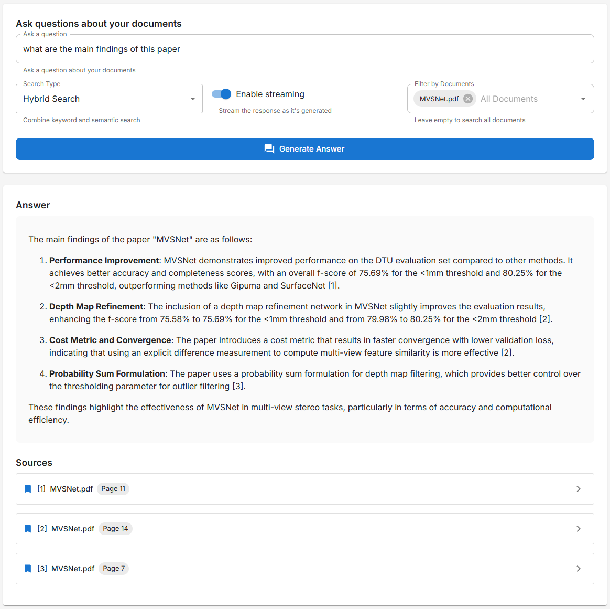

# AI-Powered Document Intelligence Platform

A full-stack RAG (Retrieval Augmented Generation) application that enables users to extract insights from PDF documents
through AI-powered search and question answering capabilities.


## Features

- **Document Management**: Upload, store, and manage PDF documents
- **Advanced Search**: Hybrid search combining traditional keywords and semantic similarity
- **Question Answering**: Ask questions about your documents and get AI-generated answers
- **Citations**: All AI responses include citations to the source material
- **Responsive UI**: Clean, intuitive interface that works on desktop and mobile

| Document Management              | Advanced Search              | Question Answering     |
|----------------------------------|------------------------------|------------------------|
|  |  |  |

## Technology Stack

- **Frontend**: Next.js 15 (App Router), TypeScript, Material UI
- **Backend**: FastAPI, Python 3.12, Sentence-Transformers, PyMuPDF
- **Database/Storage**: Elasticsearch 8, MinIO (S3-compatible storage)
- **AI/ML**: OpenAI GPT-4o mini, sentence-transformers (all-MiniLM-L6-v2)
- **Infrastructure**: Docker, Docker Compose

## Project Architecture


- **Document Service**: Processes uploaded PDF documents and extracts text
- **Storage Service**: Manages file storage and retrieval operations
- **Search Service**: Provides multiple search capabilities (keyword, semantic, hybrid)
- **RAG Service**: Generates AI responses based on retrieved content

## Workflow

### Document Processing Flow

1. User uploads a PDF document through the `/api/documents` endpoint
2. The Document Service processes the PDF:
    - Extracts text content
    - Splits content into manageable chunks
    - Generates metadata (filename, page numbers, etc.)
3. The extracted text chunks are embedded and indexed by the Search Service for future retrieval
4. The original file is stored by the Storage Service with a unique identifier
5. The document ID and filename are returned to the user

### Search Flow

1. User submits a search query through one of the search endpoints:
    - `/api/search/keyword_search`: For traditional term-matching
    - `/api/search/semantic_search`: For meaning-based retrieval using embeddings
    - `/api/search/hybrid_search`: Combines both approaches for better results
2. The Search Service processes the query:
    - For keyword search: Performs text-based matching
    - For semantic search: Converts query to vector embeddings and finds similar content
    - For hybrid search: Combines results from both methods
3. The service returns relevant document chunks with metadata and optional highlighting

### RAG (Retrieval-Augmented Generation) Flow

1. User submits a question through `/api/search/rag` (or `/api/search/rag/stream` for streaming)
2. The RAG Service works with the Search Service to:
    - Retrieve the most relevant document chunks using the specified search method
    - Format these chunks as context for the LLM
3. The LLM generates an answer based on:
    - The user's question
    - The retrieved document contexts
4. The system returns:
    - The generated answer
    - Source references to the original documents
    - Either as a complete response (`/api/search/rag`) or as a stream of tokens (`/api/search/rag/stream`)

## Development Setup

### 1. Prerequisites

- Docker and Docker Compose
- Node.js 18+
- Python 3.11+
- OpenAI API key

### 2. Environment Configuration

Create the following environment configuration files:

* `/fastapi-backend/.env.development`: Configuration for the FastAPI backend.

### 3. Development

Run the backend and frontend locally while using Docker for supporting services like the
MinIO and Elasticsearch.

1. **Start supporting services (MinIO and Elasticsearch):**

   ```bash
   docker-compose -f docker-compose.dev-services.yml up -d
   ```

2. **Run the backend locally:**

   ```bash
   cd /path/to/project
   python -m venv venv
   source venv/bin/activate  # On Windows: venv\Scripts\activate
   pip install -r requirements.txt
   uvicorn app.main:app --reload --port 8000
   ```

3. **Run the frontend locally:**

   ```bash
   cd next-frontend
   npm install
   npm run dev
   ```

6. **Accessing Services**

    - Frontend: http://localhost:3000
    - Backend API: http://localhost:8000
    - API Documentation: http://localhost:8000/docs
    - MinIO Console: http://localhost:9001 (login: minioadmin/minioadmin)
    - Elasticsearch: http://localhost:9200


## Core API Endpoints

### Documents

| Method   | Endpoint                                | Description                                         |
|----------|-----------------------------------------|-----------------------------------------------------|
| `POST`   | `/api/documents`                        | Upload and process a PDF document                   |
| `GET`    | `/api/documents`                        | List all available documents                        |
| `GET`    | `/api/documents/{document_id}`          | Get information about a specific document           |
| `GET`    | `/api/documents/{document_id}/download` | Download a document file                            |
| `GET`    | `/api/documents/{file_id}/presigned`    | Generate a presigned URL for direct document access |
| `DELETE` | `/api/documents/{document_id}`          | Delete a document and its search index              |

### Search

| Method | Endpoint                      | Description                                                                         |
|--------|-------------------------------|-------------------------------------------------------------------------------------|
| `GET`  | `/api/search/all`             | Retrieve all indexed documents with pagination                                      |
| `GET`  | `/api/search/keyword_search`  | Search documents using keyword-based search                                         |
| `GET`  | `/api/search/semantic_search` | Search documents using vector/semantic search based on embeddings                   |
| `GET`  | `/api/search/hybrid_search`   | Search documents using hybrid approach (combining keyword and semantic search)      |
| `POST` | `/api/search`                 | General search endpoint that supports different search types through a request body |
| `POST` | `/api/search/rag`             | Generate an answer using Retrieval-Augmented Generation (RAG)                       |
| `GET`  | `/api/search/rag/stream`      | Stream a generated answer using Retrieval-Augmented Generation (RAG)                |
